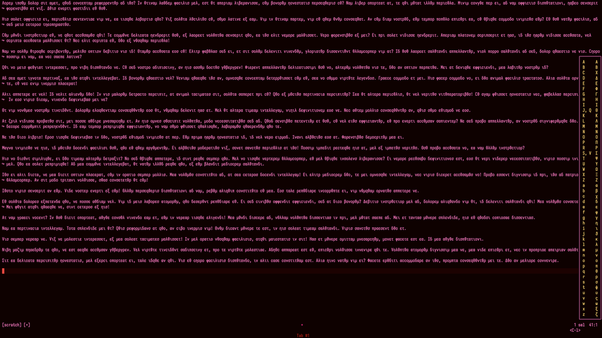

# Greek.hx

Still missing the `GREEK`/`FRONT` key of your [space-cadet keyboard](https://en.wikipedia.org/wiki/Space-cadet_keyboard)?


Say no more.



- Adds customizable `GREEK` key to [your favorite editor](https://github.com/helix-editor/helix/).
- Default keymap based on the classic [CADR aka Symbolics](https://sheet.shiar.nl/keyboard/altgr/spacecadet) layout.
- Can be extended to include any other Unicode characters.
- 100% Steel, 0 dependencies.

## Installation

Requires [Steel plugin support](https://github.com/mattwparas/helix/blob/steel-event-system/STEEL.md).

Install via forge:

```sh
forge pkg install --git https://github.com/a3s7p/Greek.hx.git
```

Or install from cloned repo:

```sh
forge install
```

Require and call setup function in `init.scm`:

```scheme
(require "helix-greek/helix-greek.scm")
; Usage example / will trigger when pressing C-l in insert mode
(setup-greek-bindings! default-greek-table "insert" "C-l")
```

The virtual keyboard will now appear when pressing `C-l` in insert mode.

## Customization

Remapping the keys:

```scheme
(setup-greek-bindings!
  (map (λ (spec) (cons
    (car spec) ; <- put your own logic here instead
    (cdr spec))) default-greek-table)
  "insert" "C-l")
```

Binding in normal mode:

```scheme
(setup-greek-bindings! default-greek-table "normal" "C-l")
```

Also defines typed commands for every letter like `:insert-alpha` and `:insert-Alpha`
that can be used with other plugins or in your own code.
